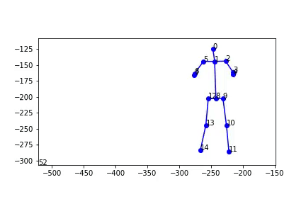

# learn2dance

<https://github.com/ardapekis/learn2dance>

*insert how to use code here*

# Using the Discriminative Model

## Processing the Data
1. Run `extract_poses.sh`. This will take a while, and requires GPUs and nvidia-docker.
2. Run `Clustering.ipynb`. This will run kmeans on the poses and save the centroids.
3. Run `Process_Waves.ipynb`. This will save music features, extracted with librosa.

## Training and Evaluation
### For training:
Run `train.py` or use `Model.ipynb`. This will train and save the model.
### For evaluation:
Run `eval.py` or use `Model.ipynb`. This will save an animation of the predicted dance.

# Using the GAN Model
We based our GAN model off of this [paper](https://arxiv.org/abs/1711.08682).

## Data format
You will require data in the format of numpy arrays of size `(number of timesteps, num_joints, 2)`. If you run [OpenPose](https://github.com/CMU-Perceptual-Computing-Lab/openpose) to get a sequence of joints, then you can simply run `parse.py` to parse the `.json` files into np arrays.

## Training
* Training happens in two steps: (1) training the pose GAN; (2) training the pose-sequence GAN.
1. Pose GAN: run `train_pose.py` with `datadir` as a parameter specifying where the `.npz` files are at (each file corresponding to a dance sequence).
2. Sequence GAN: run `train_seq.py` again with the `datadir` parameter.

## Animating poses
To visualize a pose sequence, run `animate.py`.

# Preliminary Results

## Discriminative Model

## GAN Model

# Advice for Future Work

The most obvious task would be to get a higher accuracy with the results, and collecting and training on more data would definitely help with that. In addition, it may be a good idea to focus on one specific type of dance or song category, and attempt to collect data that specifically relates to that one type of dance, such as hip-hop, and get good results on that before including other categories. There is ongoing research at Georgia Tech (https://www.cc.gatech.edu/cpl/projects/dance/) that focuses on specific dance categories and obtaining their dataset would have helped us achieve faster and better results. With respect to the models, we may have been a bit ambitious with this project and better results may be obtained by training the model category-wise. 

But above all - have fun with this! We enjoyed working on this project and it was a lot of fun, regardless of the results. We all learned a lot and who knows? Maybe you'll even learn2dance a little :D
